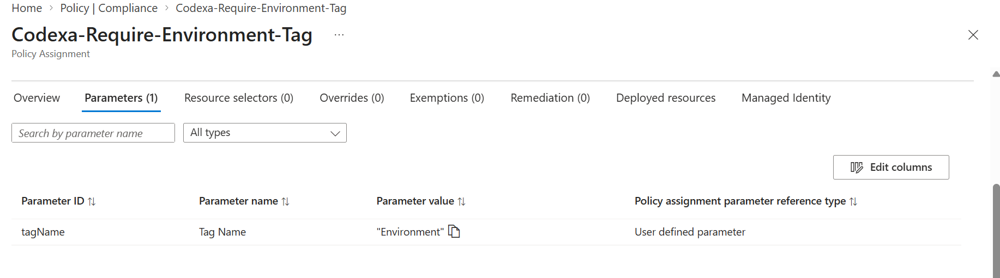
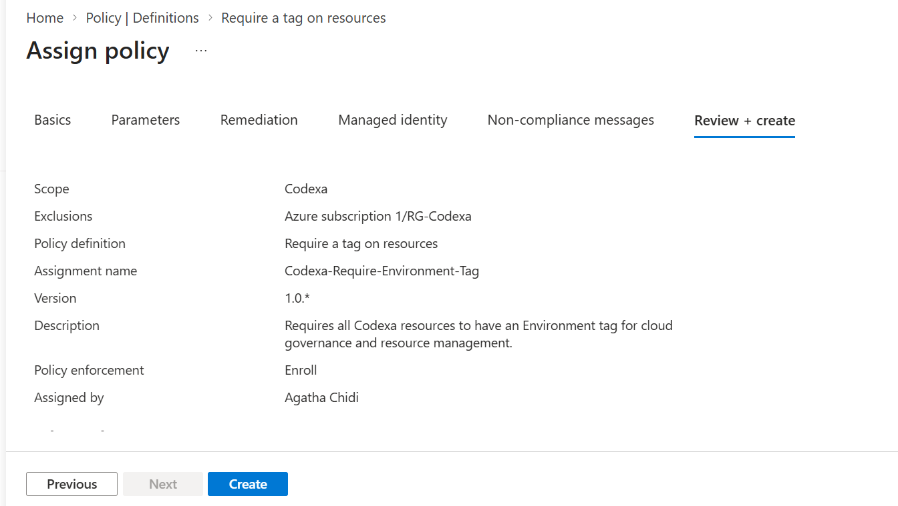
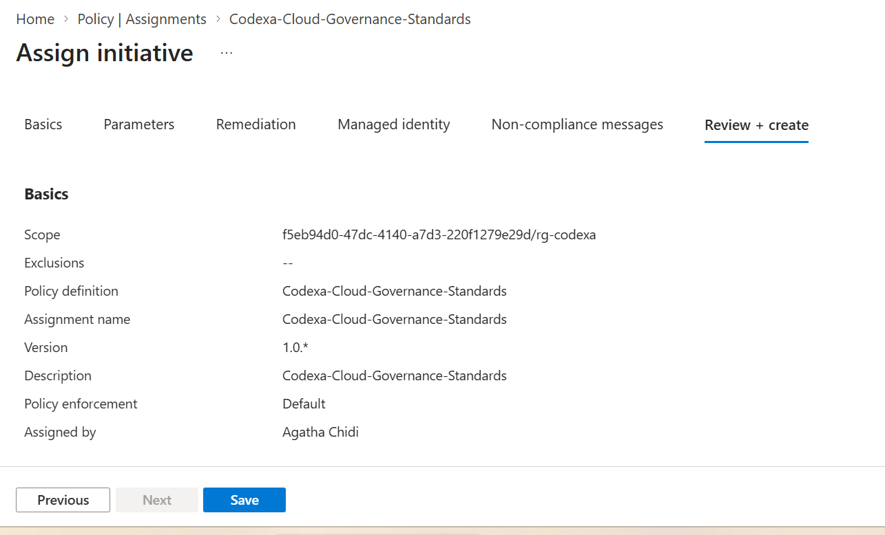
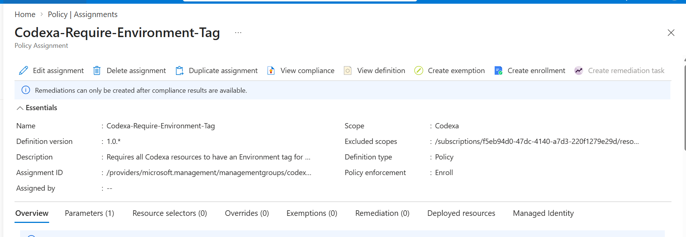
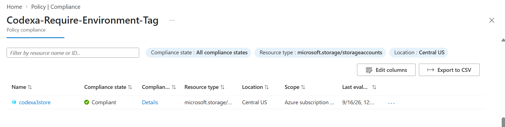
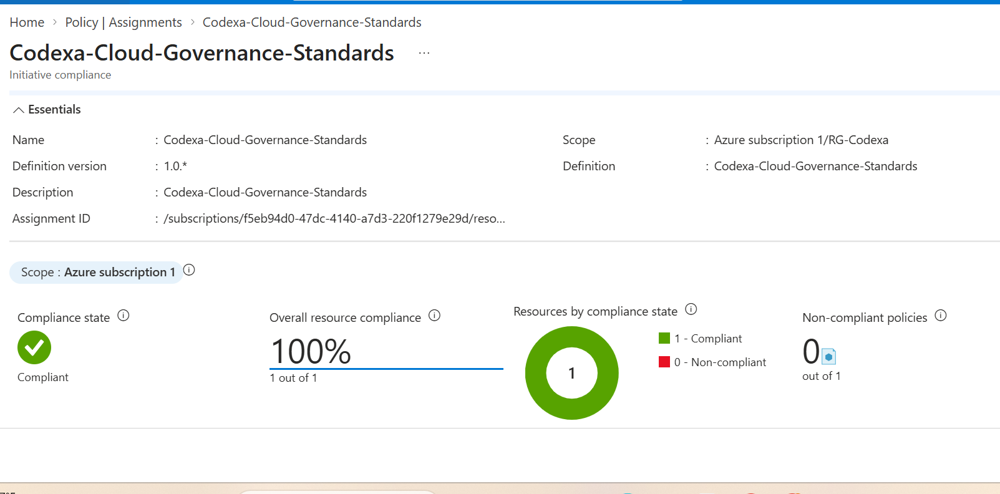
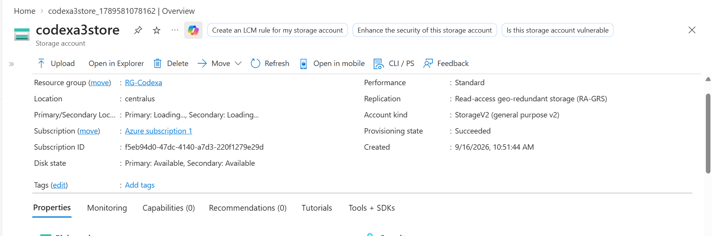
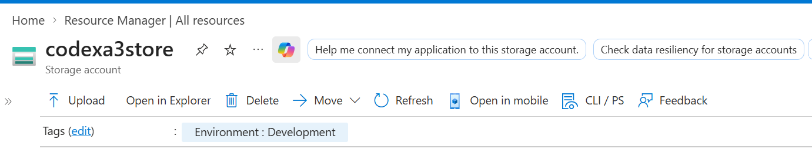
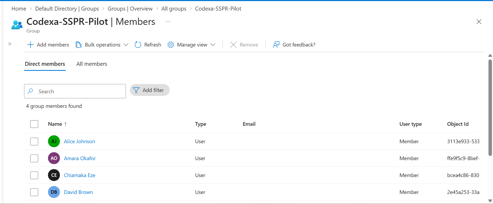

# Codexa Cloud Governance & Identity Security Assessment

A hands-on Microsoft Azure governance and identity security assessment for a simulated organization, **Codexa**, using Azure Policy and Microsoft Entra ID.

## Project Overview

This project demonstrates a practical cloud-governance workflow: defining governance standards, assigning an Azure Policy initiative to a resource group, evaluating compliance, and managing a small set of Microsoft Entra ID identities for an identity-security assessment.

The assessment was performed in a controlled Azure environment using `RG-Codexa`.

## Technologies & Services

- Microsoft Azure
- Azure Policy
- Azure Policy Initiatives
- Microsoft Entra ID
- Identity and Access Management (IAM)
- Cloud Governance and Compliance
- Azure Resource Groups

## Environment

| Component | Configuration |
|---|---|
| Resource Group | `RG-Codexa` |
| Governance Initiative | `Codexa-Cloud-Governance-Standards` |
| Definition Version | `1.0.*` |
| Governance Policy Group | `Codexa-Governance-Policies` |
| Scope | Azure Subscription 1 / `RG-Codexa` |
| Identity Pilot | 3 Codexa Marketing users |

## Governance Implementation

A governance initiative named **Codexa-Cloud-Governance-Standards** was assigned to the `RG-Codexa` scope.

The initiative groups the Codexa governance controls under **Codexa-Governance-Policies**, providing a centralized way to evaluate resource compliance against the defined standards.

### Governance Initiative

### Policy Assignment

### Assignment Review

## Compliance Assessment

The final Azure Policy assessment reported:

| Metric | Result |
|---|---|
| Compliance state | **Compliant** |
| Overall resource compliance | **100%** |
| Compliant resources | **1 of 1** |
| Non-compliant resources | **0** |
| Non-compliant policies | **0** |

The result represents the resources evaluated within the scope of this specific policy assignment; it does not imply universal compliance for every Azure resource outside that scope.

### Compliance Evidence

### Compliance Assessment Detail

## Resource Testing & Remediation

The project also included testing a resource against the governance standards and reviewing the resulting compliance/remediation workflow.

## Identity Management

Three sample **Codexa Marketing** users were created in Microsoft Entra ID for the identity-management portion of the assessment. The limited pilot was sufficient to demonstrate the user-management workflow without creating unnecessary test accounts.

### SSPR Pilot Members

Authentication configuration was also reviewed for a sample user. At the time of review, the account had no registered usable authentication methods. This identity observation is documented separately from the Azure Policy compliance result.

## Key Findings

### 1. Governance Compliance

The evaluated Codexa resource was compliant with the assigned governance initiative, producing a **100% compliance result for the evaluated scope**.

### 2. Centralized Policy Management

Governance controls were grouped into a reusable Azure Policy initiative, providing a centralized mechanism for applying and assessing organizational standards.

### 3. Resource Compliance Testing

A test resource was evaluated against the governance controls, providing evidence of the compliance and remediation workflow.

### 4. Identity Management

A three-user Marketing pilot was established in Microsoft Entra ID to demonstrate identity-management and authentication-review activities.

### 5. Authentication Readiness

The reviewed identity had no registered usable authentication methods at the time of assessment. This highlights the need to validate authentication registration separately from resource-policy compliance when implementing identity controls.

## Skills Demonstrated

✓ Azure Policy and cloud governance

✓ Policy initiative creation and assignment

✓ Azure resource compliance assessment

✓ Compliance and remediation workflow analysis

✓ Microsoft Entra ID user management

✓ Authentication-method review

✓ Identity and access management fundamentals

✓ Technical evidence collection

✓ Cloud governance documentation

## Project Evidence

All captured assessment evidence is stored in the [`screenshots`](screenshots/) directory.

## Outcome

The Codexa project demonstrates an end-to-end cloud-governance assessment workflow: define governance standards, organize them into an Azure Policy initiative, assign the initiative to a controlled scope, evaluate compliance, test resource behavior, and review identity configuration in Microsoft Entra ID.

The project also demonstrates the distinction between **Azure resource-policy compliance** and **identity/authentication configuration**, which are related but separate areas of cloud administration and security.
